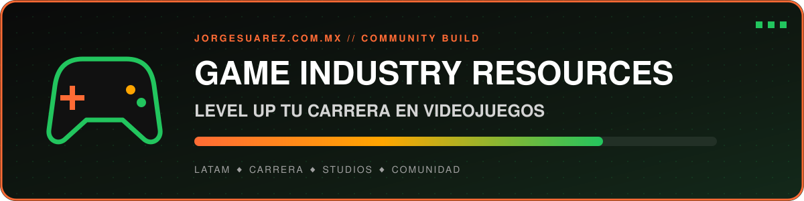

[🚀 Explorar el sitio](https://gamedev.jorgesuarez.com.mx) · [🐙 Ver código](https://github.com/jorgefsb/game-industry-resources) · **Estado:** activo / trabajo en progreso

**Un hub abierto para compartir herramientas, guías y rutas de carrera con la comunidad de videojuegos en Latinoamérica.**

---

## 🌟 ¿Qué es esto?

Una colección en crecimiento de recursos, templates, guías y herramientas para ayudar a **desarrolladores de videojuegos en LATAM** a:

- 🚀 **Fundar studios rentables** desde cero
- 📋 **Acceder a templates profesionales** probados con publishers AAA
- 🌎 **Conectar con el ecosistema** de publishers, grants y eventos
- 🎓 **Aprender de profesionales** con experiencia real en la industria

---

## 📚 Contenido

### ✅ Disponible Ahora
- 🏠 Landing page con recursos principales

### 🚧 En Desarrollo
| Recurso | Descripción | Status |
|---------|-------------|--------|
| 📋 **Studio Templates** | Pitch deck, GDD, finance tracker, publisher CRM | Próximamente |
| 🤝 **Wizard de Fundadores** | Genera acuerdos entre co-fundadores | Próximamente |
| 🌎 **LATAM Database** | Publishers, grants, eventos, studios | Próximamente |
| 🚀 **Zero to Studio Guide** | Roadmap completo para crear un studio | Próximamente |
| 📢 **Marketing Playbook** | Estrategias de launch e influencers | Próximamente |
| ⚖️ **Legal Básico** | Contratos e IP para studios | Próximamente |

---

## 🔗 Ecosistema

Este proyecto es parte de un ecosistema más amplio para impulsar a game devs:

| Plataforma | Descripción |
|------------|-------------|
| [🎮 EGDC - Echo Gamedev Club](https://comunidad.uetc.mx) | Comunidad exclusiva de desarrolladores |
| [🎓 Cursos VIP](https://vip.jorgesuarez.com.mx) | Masterclasses y mentorías premium |
| [🏫 UETC](https://uetc.mx) | Formación profesional completa |
| [🏢 Amber Studio](https://amberstudio.com) | Estudio de desarrollo profesional |
| [🎯 PlayPitch](https://playpitch.com) | Conecta juegos con influencers |

---

## 💡 ¿De dónde viene?

El proyecto reúne aprendizajes de más de dos décadas construyendo videojuegos, estudios y comunidad desde México. No pretende tener la última palabra: es un mapa abierto que mejora con la experiencia de quienes hacen juegos en la región.

---

## 🤝 Contribuir

¡Las contribuciones son bienvenidas! Si conoces un recurso que debería estar aquí:

1. Abre un **Issue** describiendo el recurso
2. O envía un **Pull Request** con tu adición

---

**Hecho con ❤️ para LATAM por [Jorge Suarez](https://jorgesuarez.com.mx)**

[🎮 EGDC](https://comunidad.uetc.mx) • [🎓 VIP](https://vip.jorgesuarez.com.mx) • [🏫 UETC](https://uetc.mx) • [🏢 Amber](https://amberstudio.com)

